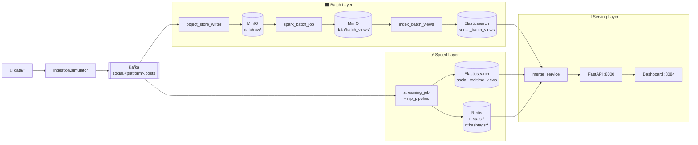

# Social Media Lambda Pipeline

Pipeline xử lý dữ liệu mạng xã hội theo kiến trúc Lambda. Thu thập bài đăng từ Reddit, Facebook và Instagram; chuẩn hóa về canonical schema; lưu raw data vào MinIO; xử lý batch bằng Spark; xử lý realtime bằng Spark Structured Streaming; phục vụ dữ liệu qua FastAPI và dashboard tĩnh.

Nhánh này triển khai trên **Kubernetes local** bằng Minikube.

## Mục Lục

- [Kiến trúc hệ thống](#kiến-trúc-hệ-thống)
- [Danh sách service](#danh-sách-service)
- [Yêu cầu môi trường](#yêu-cầu-môi-trường)
- [Khởi động nhanh](#khởi-động-nhanh)
- [Hướng dẫn chi tiết](#hướng-dẫn-chi-tiết)
- [Replay và chạy pipeline thủ công](#replay-và-chạy-pipeline-thủ-công)
- [Kiểm tra kết quả](#kiểm-tra-kết-quả)
- [Reset hệ thống](#reset-hệ-thống)
- [Tắt dự án](#tắt-dự-án)
- [Luồng dữ liệu chi tiết](#luồng-dữ-liệu-chi-tiết)
- [Cấu hình biến môi trường](#cấu-hình-biến-môi-trường)
- [Xử lý lỗi thường gặp](#xử-lý-lỗi-thường-gặp)
- [Makefile Reference](#makefile-reference)

---

## Kiến Trúc Hệ Thống



---

## Danh Sách Service

| Service | Vai trò | URL / Cổng Host |
|---|---|---|
| Kafka | Message broker | `localhost:9092` |
| MinIO Console | Object storage UI | http://localhost:9001 |
| Spark Master | Cluster UI | http://localhost:8080 |
| Redis | Cache realtime | `localhost:6379` |
| Elasticsearch | Serving indexes | http://localhost:9200 |
| FastAPI | Serving API | http://localhost:8000 |
| Dashboard | UI tĩnh | http://localhost:8084 |
| Grafana | Metrics | http://localhost:3000 |
| Airflow | Orchestration | http://localhost:8082 |

MinIO mặc định: `minioadmin` / `minioadmin`

---

## Yêu Cầu Môi Trường

- **Minikube** với Docker driver
- **kubectl** đã kết nối tới cluster
- **Docker Engine**
- RAM trống: tối thiểu **8 GB**, khuyến nghị **12 GB**
- CPU: tối thiểu **4 cores**

---

## Khởi Động Nhanh

```bash
git clone <repo-url>
cd IT4931
make download-data                         # Tải dữ liệu mẫu từ Google Drive

# Khởi động Minikube với mount thư mục dự án
minikube start --memory=8192 --cpus=4 \
  --mount --mount-string="$(pwd):/social-pipeline"

eval $(minikube docker-env)                # Trỏ Docker CLI vào daemon Minikube
make build-core                            # Build các image cần thiết

make apply                                 # Deploy toàn bộ lên k8s
make forward                               # Mở port-forward ra host (giữ terminal này)

# Đợi ~2 phút để simulators chạy xong, sau đó:
make batch                                 # Chạy Spark batch job (~20 phút)
make index-batch                           # Index batch views vào Elasticsearch
# Xem kết quả tại: http://localhost:8084
```

---

## Hướng Dẫn Chi Tiết

### 1. Chuẩn bị dữ liệu

```bash
make download-data
```

Tải và giải nén tự động toàn bộ dữ liệu mẫu từ Google Drive vào `data/`.

### 2. Khởi động Minikube

> **Quan trọng (Docker driver trên Linux):** `minikube mount` không hoạt động sau khi đã start. Phải truyền `--mount` ngay lúc khởi động và **giữ terminal chạy** trong suốt quá trình dùng.

```bash
minikube start --memory=8192 --cpus=4 \
  --mount --mount-string="/path/to/IT4931:/social-pipeline"
```

Thay `/path/to/IT4931` bằng đường dẫn tuyệt đối đến thư mục dự án.

### 3. Build Docker Images

Các manifest dùng `imagePullPolicy: Never` nên image phải được build **bên trong daemon của Minikube**.

```bash
eval $(minikube docker-env)    # Trỏ Docker CLI vào daemon Minikube

make build-core                # Build: social-python, social-spark, social-ml
make build-airflow             # (Tùy chọn) Build Airflow image (~5–10 phút)
```

### 4. Deploy lên Kubernetes

```bash
make apply
```

Kiểm tra các Pod cho đến khi tất cả ở trạng thái `Running` hoặc `Completed`:

```bash
make ps
```

Thứ tự khởi động dự kiến (mỗi bước mất 1–3 phút):

| Bước | Pod | Trạng thái cuối |
|---|---|---|
| 1 | `kafka`, `zookeeper`, `minio`, `redis`, `elasticsearch`, `cassandra` | `Running` |
| 2 | `kafka-init`, `minio-init` | `Completed` |
| 3 | `object-store-writer`, `speed-streaming`, `api`, `dashboard` | `Running` |
| 4 | `replay-reddit`, `replay-facebook`, `replay-instagram` | `Completed` |
| 5 | `prometheus`, `grafana`, `airflow-*` | `Running` |

### 5. Mở port-forward

```bash
make forward
```

Giữ terminal này chạy. Lệnh sẽ forward 9 service ra host.

### 6. Chạy Batch Pipeline

Đợi ~60 giây sau khi simulators `Completed` để `object-store-writer` flush Parquet vào MinIO.

```bash
make batch          # Spark batch job (~20 phút)
make index-batch    # Index batch views vào Elasticsearch
```

### 7. (Tùy chọn) Nạp vào ClickHouse Data Warehouse

```bash
make warehouse
```

---

## Replay Và Chạy Pipeline Thủ Công

Simulators chạy dưới dạng **Kubernetes Job** — chạy một lần duy nhất rồi `Completed`. Mỗi lần replay cần xóa Job cũ và tạo lại.

> ⚠️ **Tránh replay nhiều lần liên tiếp:**
> Speed Layer dùng `HINCRBY` để cộng dồn counter vào Redis (`rt:stats:*`).
> Replay cùng dữ liệu nhiều lần sẽ **cộng thêm** vào số đếm cũ, khiến
> "Realtime Posts" trên dashboard bị phình lên so với thực tế.
>
> Reset Redis trước khi replay lại:
> ```bash
> kubectl exec -n social-pipeline deployment/redis -- redis-cli FLUSHDB
> ```

### Replay một platform cụ thể

```bash
kubectl delete job -n social-pipeline replay-instagram
kubectl apply -f k8s/07-simulators/replay.yaml
```

### Replay toàn bộ

```bash
kubectl delete job -n social-pipeline replay-reddit replay-facebook replay-instagram 2>/dev/null
kubectl apply -f k8s/07-simulators/replay.yaml
```

### Chạy lại batch pipeline sau khi replay

```bash
make batch && make index-batch
```

---

## Kiểm Tra Kết Quả

```bash
# Health check API
curl -fsS http://localhost:8000/health

# Danh sách posts
curl -fsS "http://localhost:8000/api/v1/posts?limit=5&start=2026-01-01T00:00:00Z" | python3 -m json.tool

# Sentiment trend
curl -fsS "http://localhost:8000/api/v1/sentiment/trend?start=2026-01-01T00:00:00Z" | python3 -m json.tool

# Top hashtags
curl -fsS "http://localhost:8000/api/v1/hashtags/top?window_hours=24&top_n=10" | python3 -m json.tool

# Thống kê realtime
curl -fsS "http://localhost:8000/api/v1/stats/realtime" | python3 -m json.tool
```

Kiểm tra logs:

```bash
make logs-simulator    # Logs 3 simulator Jobs
make logs-speed        # Logs speed-streaming
make logs-writer       # Logs object-store-writer
make logs              # Logs serving API
```

---

## Reset Hệ Thống

```bash
make delete            # Xóa namespace social-pipeline
make apply             # Deploy lại
make forward           # Mở port-forward lại
# Đợi simulators Completed, sau đó:
make batch && make index-batch
```

---

## Tắt Dự Án

```bash
# Tắt port-forward: Ctrl+C tại terminal đang chạy make forward
minikube stop          # Dừng cluster, giữ nguyên dữ liệu
```

Xóa hoàn toàn cluster:

```bash
minikube delete
```

---

## Luồng Dữ Liệu Chi Tiết

### Kafka topics

| Topic | Mô tả |
|---|---|
| `social.reddit.posts` | Post Reddit đã normalize |
| `social.facebook.posts` | Post Facebook đã normalize |
| `social.instagram.posts` | Post Instagram đã normalize |
| `social.enriched.posts` | Post sau NLP enrichment từ speed layer |
| `social.dlq` | Record lỗi validation |

### Raw data (MinIO)

`object_store_writer` ghi Parquet partition theo platform/ngày:

```
s3a://social-lake/data/raw/<platform>/year=YYYY/month=MM/day=DD/
```

### Batch views (MinIO → Elasticsearch)

| View | Nội dung |
|---|---|
| `platform_daily_stats` | Post count, avg sentiment, total engagement theo ngày |
| `top_hashtags_weekly` | Top 100 hashtag theo tuần |
| `author_activity` | Hoạt động theo author |
| `sentiment_time_series` | Avg sentiment theo giờ |
| `top_posts` | Top 1000 posts theo engagement |

Output: `s3a://social-lake/data/batch_views/<view_name>/`
Index: `social_batch_views`

### Realtime views (Redis + Elasticsearch)

| Store | Key pattern | Nội dung |
|---|---|---|
| Redis | `rt:stats:<platform>:<hour>` | Post count, sentiment sum |
| Redis | `rt:hashtags:<platform>:<hour>` | Sorted set hashtag count |
| Elasticsearch | `social_realtime_views` | Post với enrichment fields |

---

## Cấu Hình Biến Môi Trường

Khai báo trong [k8s/01-config/configmap.yaml](k8s/01-config/configmap.yaml):

| Biến | Mặc định | Ý nghĩa |
|---|---|---|
| `STREAM_STARTING_OFFSETS` | `latest` | Offset bắt đầu streaming |
| `STREAM_TRIGGER_SECS` | `5` | Trigger interval Spark Streaming (giây) |
| `SPEED_WRITE_BATCH_SIZE` | `500` | Số record ghi mỗi micro-batch |
| `CONSUMER_FLUSH_SIZE` | `500` | Số record flush raw Parquet |
| `CONSUMER_FLUSH_INTERVAL` | `30` | Flush interval raw writer (giây) |
| `REALTIME_WINDOW_HOURS` | `24` | Window realtime khi serving merge |
| `NLP_MODEL_NAME` | `distilbert-base-uncased-finetuned-sst-2-english` | Model sentiment |

---

## Xử Lý Lỗi Thường Gặp

### API trả về rỗng

```bash
# Kiểm tra ES có data không
curl -fsS http://localhost:9200/_cat/indices?v

# social_batch_views rỗng → chạy lại batch
make batch && make index-batch
```

### Speed-streaming crash sau khi restart Minikube

Checkpoint cũ lưu offset của partitions không còn tồn tại. Xóa checkpoint và rollout lại:

```bash
kubectl exec -n social-pipeline deployment/minio -- \
  bash -c "mc alias set l http://localhost:9000 minioadmin minioadmin 2>/dev/null && \
           mc rm -r --force l/social-lake/checkpoints/speed/"
kubectl rollout restart deployment/speed-streaming -n social-pipeline
```

### Elasticsearch bị OOMKill (exit code 137)

ES 8.x cần JVM heap + direct memory + Lucene mmap. Tăng limit trong [k8s/03-infrastructure/elasticsearch.yaml](k8s/03-infrastructure/elasticsearch.yaml):

```yaml
resources:
  requests:
    memory: 768Mi
  limits:
    memory: 1536Mi
```

### Elasticsearch node.lock conflict khi rollout

Đảm bảo Deployment có `strategy.type: Recreate` để dừng pod cũ trước khi khởi pod mới:

```yaml
spec:
  strategy:
    type: Recreate
```

### Batch job không thấy raw data Instagram

`object-store-writer` chỉ flush khi đủ `CONSUMER_FLUSH_SIZE` records (mặc định 500). Với dữ liệu mẫu ít, cần đợi `CONSUMER_FLUSH_INTERVAL` giây (30s) để auto-flush, hoặc replay thêm.

### Dashboard hiển thị số post bị phình

Xảy ra khi có Deployment simulator cũ (dùng `--loop true`) còn sót. Kiểm tra và xóa:

```bash
kubectl get deployments -n social-pipeline | grep replay
kubectl delete deployment -n social-pipeline replay-reddit replay-facebook replay-instagram
```

---

## Makefile Reference

| Lệnh | Mô tả |
|---|---|
| `make build-core` | Build core images: `social-python`, `social-spark`, `social-ml` |
| `make build-airflow` | Build Airflow image (~5–10 phút) |
| `make build` | Build tất cả images (core + airflow) |
| `make download-data` | Tải và giải nén dữ liệu mẫu từ Google Drive |
| `make apply` | Apply toàn bộ manifests lên Kubernetes |
| `make delete` | Xóa namespace `social-pipeline` trên k8s |
| `make forward` | Port-forward 9 service ra host |
| `make batch` | Chạy Spark batch job trên k8s |
| `make index-batch` | Index batch views vào Elasticsearch |
| `make warehouse` | Nạp dữ liệu vào ClickHouse |
| `make ps` | Trạng thái các Pod trong namespace `social-pipeline` |
| `make logs` | Logs Serving API pod |
| `make logs-writer` | Logs Object Store Writer pod |
| `make logs-speed` | Logs Speed Streaming pod |
| `make logs-simulator` | Logs 3 simulator Jobs (reddit, facebook, instagram) |
| `make test` | Chạy unit tests |
