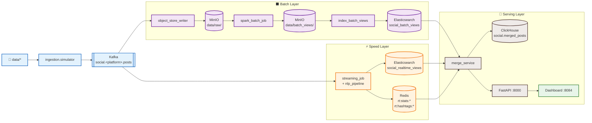

# Social Media Lambda Pipeline

Pipeline xử lý dữ liệu mạng xã hội theo kiến trúc Lambda. Thu thập bài đăng từ Reddit, Facebook và Instagram; chuẩn hóa về canonical schema; lưu raw data vào MinIO; xử lý batch bằng Spark; xử lý realtime bằng Spark Structured Streaming; phục vụ dữ liệu qua FastAPI và dashboard tĩnh.

Nhánh này triển khai trên **Kubernetes local** bằng Minikube.

## Mục Lục

- [Kiến trúc hệ thống](#kiến-trúc-hệ-thống)
- [Danh sách service](#danh-sách-service)
- [Yêu cầu môi trường](#yêu-cầu-môi-trường)
- [Khởi động nhanh](#khởi-động-nhanh)
- [Hướng dẫn chi tiết](#hướng-dẫn-chi-tiết)
- [Reset sạch và chạy lại bằng Airflow](#reset-sạch-và-chạy-lại-bằng-airflow)
- [Kiểm tra kết quả](#kiểm-tra-kết-quả)
- [Reset hệ thống](#reset-hệ-thống)
- [Tắt dự án](#tắt-dự-án)
- [Luồng dữ liệu chi tiết](#luồng-dữ-liệu-chi-tiết)
- [Cấu hình biến môi trường](#cấu-hình-biến-môi-trường)
- [Xử lý lỗi thường gặp](#xử-lý-lỗi-thường-gặp)
- [Makefile Reference](#makefile-reference)

---

## Kiến Trúc Hệ Thống




---

## Danh Sách Service

| Service | Vai trò | URL / Cổng Host |
|---|---|---|
| Kafka (KRaft) | Message broker | `localhost:9092` |
| MinIO Console | Object storage UI | http://localhost:9001 |
| Spark Master | Cluster UI | http://localhost:8080 |
| ClickHouse | Serving Warehouse (batch + speed) | http://localhost:8123 |
| Elasticsearch | Full-text search & topic index | http://localhost:9200 |
| Redis | Realtime stats & network cache | `localhost:6379` |
| FastAPI | Serving API | http://localhost:8000 |
| Dashboard | UI tĩnh | http://localhost:8084 |
| Airflow | Orchestration | http://localhost:8085 |

MinIO mặc định: `minioadmin` / `minioadmin`

---

## Yêu Cầu Môi Trường

- **Minikube** với Docker driver
- **kubectl** đã kết nối tới cluster
- **Docker Engine**
- RAM trống: tối thiểu **10 GB**, khuyến nghị **14 GB**
- CPU: tối thiểu **4 cores**

---

## Khởi động nhanh

```bash
git clone <repo-url>
cd social-pipeline
make download-data                         # Tải dữ liệu mẫu từ Google Drive

# 1. Khởi động Minikube với mount thư mục dự án
minikube start --memory=10240 --cpus=4 \
  --mount --mount-string="$(pwd):/social-pipeline"

# 2. Cấu hình bộ nhớ ảo cho Elasticsearch (Bắt buộc để tránh lỗi Bootstrap check)
minikube ssh -- sudo sysctl -w vm.max_map_count=262144

# 3. Trỏ Docker CLI vào daemon Minikube & Build images (nếu chạy lần đầu)
eval $(minikube docker-env)
make build-core                            # Build các core image
make build-airflow                         # Build Airflow image (Tùy chọn)

# 4. Triển khai tài nguyên lên Kubernetes
make delete                                # Dọn dẹp namespace cũ nếu có
make apply                                 # Deploy toàn bộ manifests lên k8s

# 5. Mở port-forward ra host (chạy ngầm hoặc giữ terminal này)
make forward
```

**🚀 Chạy pipeline tự động bằng Airflow (Khuyến nghị):**

* **Cách 1 (Qua CLI):**
  ```bash
  make dag-trigger                         # Bật và kích hoạt chạy DAG
  make dag-status                          # Kiểm tra trạng thái chạy của DAG
  ```
* **Cách 2 (Qua Web UI):**
  1. Truy cập http://localhost:8085 (Tài khoản: `admin` / `admin`).
  2. Tìm DAG `social_lambda_batch_pipeline` → bật công tắc **Active**.
  3. Nhấn nút **Trigger DAG** (▶) để chạy toàn bộ luồng Batch (Spark Batch + ClickHouse Loader + Elasticsearch Indexer).

> *Lưu ý tài nguyên:* Airflow tiêu tốn ~2 GB RAM. Nếu gặp lỗi chậm/lag, có thể tắt Airflow và chạy thủ công:
> ```bash
> kubectl scale deployment -n social-pipeline airflow-webserver airflow-scheduler --replicas=0
> make batch && make warehouse
> ```

---

## Hướng Dẫn Chi Tiết

### 1. Chuẩn bị dữ liệu

```bash
make download-data
```

Tải và giải nén tự động toàn bộ dữ liệu mẫu từ Google Drive vào `data/`.

### 2. Khởi động Minikube & Cấu hình môi trường

> **Quan trọng (Docker driver trên Linux):** `minikube mount` không hoạt động sau khi đã start. Phải truyền `--mount` ngay lúc khởi động.

```bash
# Khởi động cụm minikube
minikube start --memory=10240 --cpus=4 \
  --mount --mount-string="$(pwd):/social-pipeline"

# Tăng giới hạn bộ nhớ ảo cho node Minikube (Dành cho Elasticsearch)
minikube ssh -- sudo sysctl -w vm.max_map_count=262144
```

Tự động mount thư mục hiện tại của dự án vào cụm và đảm bảo Elasticsearch không bị lỗi bootstrap check.

### 3. Build Docker Images

Các manifest dùng `imagePullPolicy: Never` nên image phải được build **bên trong daemon của Minikube**.

```bash
eval $(minikube docker-env)    # Trỏ Docker CLI vào daemon Minikube

make build-core                # Build: social-python, social-spark, social-ml
make build-airflow             # (Tùy chọn) Build Airflow image (~5–10 phút)
```

### 4. Deploy lên Kubernetes

```bash
make apply
```

Kiểm tra các Pod cho đến khi tất cả ở trạng thái `Running` hoặc `Completed`:

```bash
make ps
```

Thứ tự khởi động dự kiến (mỗi bước mất 1–3 phút):

| Bước | Pod | Trạng thái cuối |
|---|---|---|
| 1 | `kafka`, `minio`, `postgres`, `clickhouse`, `elasticsearch`, `redis` | `Running` |
| 2 | `kafka-init`, `minio-init` | `Completed` |
| 3 | `object-store-writer`, `speed-streaming`, `api`, `dashboard` | `Running` |
| 4 | `replay-reddit`, `replay-facebook`, `replay-instagram` | `Completed` |
| 5 | `airflow-*` | `Running` |

### 5. Mở port-forward

```bash
make forward
```

Giữ terminal này chạy. Lệnh sẽ forward 8 service ra host:

| Service | Local URL |
|---|---|
| Dashboard | http://localhost:8084 |
| FastAPI | http://localhost:8000 |
| MinIO Console | http://localhost:9001 |
| Airflow | http://localhost:8085 |
| ClickHouse | http://localhost:8123 |
| Spark Master | http://localhost:8080 |
| Elasticsearch | http://localhost:9200 |
| Redis | `localhost:6379` (CLI) |

### 6. Chạy Batch Pipeline bằng Airflow (Khuyến nghị)

DAG `social_lambda_batch_pipeline` được định nghĩa trong `orchestration/dags/batch_pipeline_dag.py` tự động lập lịch và kích hoạt Spark batch job, ClickHouse loader và Elasticsearch indexer.

1. Đăng nhập Airflow Web UI tại: http://localhost:8085 (Tài khoản: `admin` / `admin`).
2. Bật DAG `social_lambda_batch_pipeline` sang trạng thái **Active** (nút công tắc màu xanh).
3. Nhấn nút **Trigger DAG** để chạy ngay lập tức.

### 7. Chạy thủ công (Alternative)

Nếu bạn không muốn sử dụng Airflow hoặc muốn tiết kiệm tài nguyên RAM cho máy tính, bạn có thể chạy thủ công các lệnh sau từ terminal:

```bash
make batch          # Chạy Spark batch job thủ công (~20 phút)
make warehouse      # Nạp dữ liệu batch từ MinIO vào ClickHouse thủ công
```

---

## Reset Sạch Và Chạy Lại Bằng Airflow

Dùng khi cần xóa toàn bộ dữ liệu cũ và chạy lại pipeline từ đầu — thường dùng trong môi trường phát triển hoặc khi cần demo sạch.

> [!IMPORTANT]
> **Nếu vừa khởi động lại máy tính (Reboot):**
> Sau khi máy tính khởi động lại, các pod Kubernetes có thể gặp lỗi kết nối hoặc sai lệch trạng thái mount. Hãy làm theo các bước sau để thiết lập lại môi trường sạch hoàn toàn:
> 
> 1. **Khởi động lại Minikube & cấu hình bộ nhớ ảo**:
>    ```bash
>    minikube start --memory=10240 --cpus=4 \
>      --mount --mount-string="$(pwd):/social-pipeline"
>    
>    minikube ssh -- sudo sysctl -w vm.max_map_count=262144
>    ```
> 2. **Xóa namespace cũ và deploy lại**:
>    ```bash
>    make delete
>    make apply
>    ```
> 3. **Mở lại Port Forwarding** (giữ terminal chạy):
>    ```bash
>    make forward
>    ```
> 4. **Phát dữ liệu và Trigger DAG**:
>    ```bash
>    make replay
>    make dag-trigger
>    ```

### Reset dữ liệu khi cụm đang chạy bình thường

Nếu cụm Kubernetes của bạn đã ở trạng thái ổn định và bạn chỉ muốn xóa sạch dữ liệu để chạy lại từ đầu:

### Bước 1 & 2 — Reset sạch dữ liệu

```bash
make reset-data
```

Lệnh này tự động thực hiện:
- Tạm dừng `speed-streaming` và `object-store-writer`.
- `TRUNCATE` tất cả các bảng ClickHouse (`dim_*`, `fact_*`, `merged_posts`).
- Xóa toàn bộ indices Elasticsearch (`social_batch_views`, `social_realtime_views`, `social_network`, `social_topics`).
- Flush toàn bộ dữ liệu Redis (`FLUSHALL`).
- Xóa raw data, batch views và streaming checkpoints trong MinIO.
- Restart Kafka và tạo lại topics.
- Khôi phục lại các luồng xử lý.

### Bước 3 — Phát lại dữ liệu từ đầu

```bash
make replay
```

### Bước 4 — Kích hoạt Airflow DAG

**Cách 1 — Qua Web UI (khuyến nghị):**
1. Truy cập http://localhost:8085 (Tài khoản: `admin` / `admin`).
2. Tìm DAG `social_lambda_batch_pipeline` → bật công tắc **Active**.
3. Nhấn nút **Trigger DAG** (▶) để chạy ngay lập tức.

**Cách 2 — Qua CLI:**

```bash
make dag-trigger
```

> 💡 **Kiểm tra tiến trình DAG:**
> ```bash
> make dag-status
> ```
> Airflow sẽ tự động thực hiện tuần tự:
> 1. `check_new_data` — kiểm tra dữ liệu thô trong MinIO.
> 2. `run_spark_batch` — chạy Spark batch job (~10–20 phút).
> 3. `clickhouse_load` — nạp kết quả batch vào ClickHouse.
> 4. `elasticsearch_load` — index dữ liệu batch vào Elasticsearch.
> 5. `run_network_analysis` — phân tích mạng lưới tác giả.
> 6. `mark_raw_data_processed` — đánh dấu đã xử lý xong.

### Replay nhanh (không xóa dữ liệu cũ)

Nếu chỉ muốn phát thêm dữ liệu mà không cần reset, dùng `ReplacingMergeTree` của ClickHouse để tự động deduplicate:

```bash
make replay
```

---


## Kiểm Tra Kết Quả

```bash
# Health check API
curl -fsS http://localhost:8000/health

# Danh sách posts
curl -fsS "http://localhost:8000/api/v1/posts?limit=5&start=2026-01-01T00:00:00Z" | python3 -m json.tool

# Sentiment trend
curl -fsS "http://localhost:8000/api/v1/sentiment/trend?start=2026-01-01T00:00:00Z" | python3 -m json.tool

# Top hashtags
curl -fsS "http://localhost:8000/api/v1/hashtags/top?window_hours=24&top_n=10" | python3 -m json.tool

# Thống kê realtime
curl -fsS "http://localhost:8000/api/v1/stats/realtime" | python3 -m json.tool

# Elasticsearch health
curl -fsS "http://localhost:9200/_cluster/health?pretty"

# Kiểm tra indices ES
curl -fsS "http://localhost:9200/_cat/indices?v"

# Redis: số keys đang có
redis-cli -p 6379 DBSIZE
```

Kiểm tra logs:

```bash
make logs-simulator    # Logs 3 simulator Jobs
make logs-speed        # Logs speed-streaming
make logs-writer       # Logs object-store-writer
make logs              # Logs serving API
```

---

## Reset Hệ Thống

```bash
make delete            # Xóa namespace social-pipeline
make apply             # Deploy lại
make forward           # Mở port-forward lại
# Đợi simulators Completed, sau đó trigger Airflow DAG:
kubectl exec -n social-pipeline deployments/airflow-scheduler -- \
  airflow dags trigger social_lambda_batch_pipeline
# Hoặc chạy thủ công: make batch && make warehouse
```

---

## Tắt Dự Án

```bash
# Tắt port-forward: Ctrl+C tại terminal đang chạy make forward
minikube stop          # Dừng cluster, giữ nguyên dữ liệu
```

Xóa hoàn toàn cluster:

```bash
minikube delete
```

---

## Luồng Dữ Liệu Chi Tiết

### Kafka topics

| Topic | Mô tả |
|---|---|
| `social.reddit.posts` | Post Reddit đã normalize |
| `social.facebook.posts` | Post Facebook đã normalize |
| `social.instagram.posts` | Post Instagram đã normalize |
| `social.enriched.posts` | Post sau NLP enrichment từ speed layer |
| `social.dlq` | Record lỗi validation |

### Raw data (MinIO)

`object_store_writer` ghi Parquet partition theo platform/ngày:

```
s3a://social-lake/data/raw/<platform>/year=YYYY/month=MM/day=DD/
```

### Batch & Realtime Serving Views (ClickHouse)

Dữ liệu từ MinIO (Batch) và Kafka (Speed) được tập trung lưu trữ và truy vấn tại ClickHouse database `social`:

| Bảng | Loại (Layer) | Nội dung |
|---|---|---|
| `fact_platform_daily_stats` | Batch | Thống kê lượng post, average sentiment, engagement theo ngày |
| `fact_top_hashtags_weekly` | Batch | Top hashtags theo tuần |
| `fact_author_activity` | Batch | Tần suất hoạt động và điểm tích cực của tác giả |
| `fact_sentiment_time_series` | Batch | Biến thiên trung bình sentiment theo giờ |
| `fact_top_posts` | Batch | Danh sách 1000 bài viết nổi bật nhất |
| `merged_posts` | Serving | Bài viết sau khi gộp (merged) được ghi nhận bất đồng bộ sau bước ServeQuery |

### Elasticsearch Indices

| Index | Layer | Nội dung |
|---|---|---|
| `social_batch_views` | Batch | Kết quả batch views để full-text search |
| `social_realtime_views` | Speed | Bài viết realtime enriched cho near-realtime query |
| `social_topics` | Batch | Phân phối topic, sentiment heatmap, topic network |
| `social_network` | Batch | Đồ thị mạng lưới tác giả (nodes, edges) |

### Redis Keys

| Key pattern | Nội dung |
|---|---|
| `rt:stats:<platform>` | Thống kê realtime theo platform (post count, avg sentiment) |
| `rt:hashtags:<platform>` | Sorted set top hashtags realtime |
| `rt:network:communities` | Community membership từ batch network analysis |
| `rt:network:pagerank` | PageRank scores của các tác giả |

---

## Cấu Hình Biến Môi Trường

Khai báo trong [k8s/01-config/configmap.yaml](k8s/01-config/configmap.yaml):

| Biến | Mặc định | Ý nghĩa |
|---|---|---|
| `STREAM_STARTING_OFFSETS` | `latest` | Offset bắt đầu streaming |
| `STREAM_TRIGGER_SECS` | `5` | Trigger interval Spark Streaming (giây) |
| `SPEED_WRITE_BATCH_SIZE` | `500` | Số record ghi mỗi micro-batch |
| `CONSUMER_FLUSH_SIZE` | `500` | Số record flush raw Parquet |
| `CONSUMER_FLUSH_INTERVAL` | `30` | Flush interval raw writer (giây) |
| `REALTIME_WINDOW_HOURS` | `24` | Window realtime khi serving merge |
| `NLP_MODEL_NAME` | `distilbert-base-uncased-finetuned-sst-2-english` | Model sentiment |
| `ES_HOST` | `http://elasticsearch-service:9200` | Elasticsearch endpoint |
| `ES_BATCH_INDEX` | `social_batch_views` | Index ES cho batch views |
| `ES_REALTIME_INDEX` | `social_realtime_views` | Index ES cho realtime views |
| `REDIS_HOST` | `redis-service` | Redis hostname |
| `REDIS_PORT` | `6379` | Redis port |

---

## Xử Lý Lỗi Thường Gặp

### API hoặc Dashboard không hiển thị dữ liệu

```bash
# Kiểm tra ClickHouse có data không
make ps

# Nếu bảng batch rỗng -> trigger Airflow DAG
make dag-trigger

# Hoặc chạy thủ công:
make batch && make warehouse
```

### Speed-streaming crash sau khi restart Minikube

Checkpoint cũ lưu offset của partitions không còn tồn tại. Xóa checkpoint và rollout lại:

```bash
kubectl exec -n social-pipeline deployment/minio -- \
  bash -c "mc alias set l http://localhost:9000 minioadmin minioadmin 2>/dev/null && \
           mc rm -r --force l/social-lake/checkpoints/speed/"
kubectl rollout restart deployment/speed-streaming -n social-pipeline
```

### ClickHouse Pod bị Error/Pending khi rollout (node lock conflict trên PVC)

Đảm bảo Deployment sử dụng `strategy.type: Recreate` trong `k8s/03-infrastructure/clickhouse.yaml` để tắt hẳn pod cũ trước khi khởi động pod mới tránh tranh chấp file lock.

### Elasticsearch Pod không start (bootstrap check failed)

Elasticsearch yêu cầu `vm.max_map_count` đủ lớn. Chạy trên node Minikube:

```bash
minikube ssh -- sudo sysctl -w vm.max_map_count=262144
```

### Batch job không thấy raw data Instagram

`object-store-writer` chỉ flush khi đủ `CONSUMER_FLUSH_SIZE` records (mặc định 500). Với dữ liệu mẫu ít, cần đợi `CONSUMER_FLUSH_INTERVAL` giây (30s) để auto-flush, hoặc replay thêm.

### Dashboard hiển thị số post bị phình

Xảy ra khi có Deployment simulator cũ (dùng `--loop true`) còn sót. Kiểm tra và xóa:

```bash
kubectl get deployments -n social-pipeline | grep replay
kubectl delete deployment -n social-pipeline replay-reddit replay-facebook replay-instagram
```

---

## Makefile Reference

| Lệnh | Mô tả |
|---|---|
| `make build-core` | Build core images: `social-python`, `social-spark`, `social-ml` |
| `make build-airflow` | Build Airflow image (~5–10 phút) |
| `make build` | Build tất cả images (core + airflow) |
| `make download-data` | Tải và giải nén dữ liệu mẫu từ Google Drive |
| `make apply` | Apply toàn bộ manifests lên Kubernetes |
| `make delete` | Xóa namespace `social-pipeline` trên k8s |
| `make forward` | Port-forward 8 service ra host |
| `make forward-kill` | Dừng tất cả port-forward |
| `make batch` | Chạy Spark batch job trên k8s (thủ công) |
| `make warehouse` | Nạp dữ liệu batch từ MinIO vào ClickHouse (thủ công) |
| `make reset-data` | **Xóa sạch** toàn bộ dữ liệu (ClickHouse + MinIO + Kafka + ES + Redis) |
| `make replay` | Xóa và chạy lại 3 Simulator Jobs để phát dữ liệu từ đầu |
| `make dag-trigger` | Bật và trigger Airflow DAG `social_lambda_batch_pipeline` |
| `make dag-status` | Xem lịch sử chạy của Airflow DAG |
| `make ps` | Trạng thái các Pod trong namespace `social-pipeline` |
| `make logs` | Logs Serving API pod |
| `make logs-writer` | Logs Object Store Writer pod |
| `make logs-speed` | Logs Speed Streaming pod |
| `make logs-simulator` | Logs 3 simulator Jobs (reddit, facebook, instagram) |
| `make test` | Chạy unit tests |
