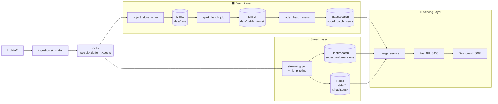

# Social Media Lambda Pipeline

Pipeline xử lý dữ liệu mạng xã hội theo kiến trúc Lambda. Thu thập bài đăng từ Reddit, Facebook và Instagram; chuẩn hóa về canonical schema; lưu raw data vào MinIO; xử lý batch bằng Spark; xử lý realtime bằng Spark Structured Streaming; phục vụ dữ liệu qua FastAPI và dashboard tĩnh.

## Mục Lục

- [Kiến trúc hệ thống](#kiến-trúc-hệ-thống)
- [Danh sách service](#danh-sách-service)
- [Yêu cầu môi trường](#yêu-cầu-môi-trường)
- [Khởi động nhanh](#khởi-động-nhanh)
- [Hướng dẫn chi tiết](#hướng-dẫn-chi-tiết)
- [Replay và chạy pipeline thủ công](#replay-và-chạy-pipeline-thủ-công)
- [Kiểm tra kết quả](#kiểm-tra-kết-quả)
- [Reset hệ thống](#reset-hệ-thống)
- [Tắt dự án](#tắt-dự-án)
- [Luồng dữ liệu chi tiết](#luồng-dữ-liệu-chi-tiết)
- [Cấu hình biến môi trường](#cấu-hình-biến-môi-trường)
- [Xử lý lỗi thường gặp](#xử-lý-lỗi-thường-gặp)
- [Test](#test)
- [Makefile Reference](#makefile-reference)

---

## Kiến Trúc Hệ Thống



---

## Danh Sách Service

### Core stack (mặc định)

| Service | Vai trò | URL / Cổng |
|---|---|---|
| Kafka | Message broker | `localhost:9092` |
| MinIO Console | Object storage UI | http://localhost:9001 |
| Spark Master | Cluster UI | http://localhost:8081 |
| Spark Worker | Worker UI | http://localhost:8083 |
| Redis | Cache realtime | `localhost:6379` |
| Elasticsearch | Serving indexes | http://localhost:9200 |
| FastAPI | Serving API | http://localhost:8000 |
| Dashboard | UI tĩnh | http://localhost:8084 |

MinIO mặc định: `minioadmin` / `minioadmin`

### Profile bổ sung

| Profile | Service | URL / Cổng |
|---|---|---|
| `debug` | Kafka UI | http://localhost:8080 |
| `debug` | Kibana | http://localhost:5601 |
| `orchestration` | Airflow | http://localhost:8082 |
| `warehouse` | ClickHouse | http://localhost:8123 (Native: 9002) |
| `monitoring` | Prometheus | http://localhost:9090 |
| `monitoring` | Grafana | http://localhost:3000 |
| `enrichment` | Cassandra | `localhost:9042` |
| `anomaly` | Cassandra + anomaly detector | `localhost:9042` |

---

## Yêu Cầu Môi Trường

- Docker Engine và Docker Compose plugin (`docker compose`, không phải `docker-compose` cũ)
- RAM trống: tối thiểu **6 GB** cho core stack, **8 GB+** khi bật thêm profile
- Các cổng chưa bị chiếm: `8000`, `8081`, `8083`, `8084`, `9000`, `9001`, `9200`, `9092`, `6379`

---

## Khởi Động Nhanh

```bash
git clone <repo-url>
cd social-pipeline
make download-data          # Tải dữ liệu mẫu từ Google Drive
docker compose build
make core-up                # Khởi động hạ tầng lõi
make app-up                 # Khởi động Spark, speed layer, API, dashboard
make orchestration          # Khởi động Airflow
make replay                 # Phát lại dữ liệu mẫu vào Kafka
# Đợi 30–60 giây, sau đó trigger DAG trong Airflow UI: http://localhost:8082
# Xem kết quả tại: http://localhost:8084
```

---

## Hướng Dẫn Chi Tiết

### 1. Chuẩn bị

```bash
git clone <repo-url>
cd social-pipeline
cp .env.example .env        # Tùy chọn — giữ mặc định nếu không cần đổi cổng/credential

# Tải và giải nén tự động toàn bộ dữ liệu mẫu từ Google Drive
make download-data
```

### 2. Build image

```bash
docker compose build
```

Chỉ build service cụ thể khi sửa code:

```bash
# Sửa API/serving code
docker compose build api serving-init

# Sửa Spark/batch/speed code
docker compose build spark-master spark-worker speed
```

### 3. Khởi động hạ tầng lõi

```bash
make core-up
```

Lệnh này khởi động: Zookeeper, Kafka, Kafka-init, MinIO, MinIO-init, Redis, Elasticsearch, serving-init.

Kiểm tra tất cả service đã `healthy`:

```bash
make ps
```

Kiểm tra Elasticsearch index đã được tạo:

```bash
docker compose exec -T elasticsearch \
  curl -fsS http://localhost:9200/_cat/indices?v
```

### 4. Khởi động Spark, speed layer, API và dashboard

```bash
make app-up
```

Kiểm tra API:

```bash
curl -fsS http://localhost:8000/health
# {"status":"ok"}
```

### 5. Bật Airflow orchestration

Airflow là orchestrator chính điều phối batch pipeline. **Khuyến nghị bật Airflow** thay vì chạy Spark thủ công.

```bash
make orchestration
```

Truy cập Airflow UI: http://localhost:8082 — `admin` / `admin`

### 6. Replay dữ liệu mẫu

```bash
make replay
```

Lệnh này khởi chạy các container replay để publish message mẫu vào Kafka. Đợi **30–60 giây** để `object-store-writer` và `speed` consume và flush dữ liệu.

### 7. Trigger batch pipeline

Vào Airflow UI, **unpause** DAG `social_lambda_batch_pipeline` rồi bấm **Trigger DAG** (▶).

Hoặc trigger bằng CLI:

```bash
docker compose exec airflow-scheduler \
  airflow dags trigger social_lambda_batch_pipeline
```

DAG sẽ thực hiện tuần tự:
1. Kiểm tra raw data mới trên MinIO
2. Chạy Spark batch job
3. Index batch views lên Elasticsearch
4. Đánh dấu dữ liệu đã xử lý
5. Gửi Slack alert (nếu đã cấu hình)

### 8. Xem kết quả

Mở dashboard: http://localhost:8084

Kiểm tra nhanh qua API:

```bash
curl -fsS "http://localhost:8000/api/v1/posts?limit=5&start=2023-01-01T00:00:00Z"
curl -fsS "http://localhost:8000/api/v1/stats/realtime"
```

> **Lưu ý:** Dữ liệu mẫu có timestamp trong quá khứ. Luôn truyền `start=2023-01-01T00:00:00Z` khi query posts/trend để đảm bảo thấy dữ liệu.

### 9. Nạp dữ liệu vào ClickHouse (Tùy chọn)

```bash
make warehouse-stack        # Khởi động ClickHouse
make warehouse              # Chạy Spark job nạp dữ liệu từ MinIO vào ClickHouse
```

---

## Replay Và Chạy Pipeline Thủ Công

### Replay qua Docker (khuyến nghị)

```bash
make replay
```

### Replay trực tiếp trên host (dev)

```bash
make replay-raw
```

Mỗi platform dùng cổng Prometheus riêng (9101/9102/9103) để tránh conflict. Dừng khi cần:

```bash
make kill-simulators
```

### Chạy batch thủ công (chỉ dùng khi debug hoặc Airflow chưa bật)

```bash
make spark-batch                        # Spark batch job
make index-batch-docker                 # Index batch views vào Elasticsearch
```

---

## Kiểm Tra Kết Quả

```bash
# Health check
curl -fsS http://localhost:8000/health

# Elasticsearch indices
docker compose exec -T elasticsearch \
  curl -fsS http://localhost:9200/_cat/indices?v

# API endpoints
curl -fsS "http://localhost:8000/api/v1/posts?limit=5&start=2023-01-01T00:00:00Z" | python3 -m json.tool
curl -fsS "http://localhost:8000/api/v1/sentiment/trend?start=2023-01-01T00:00:00Z" | python3 -m json.tool
curl -fsS "http://localhost:8000/api/v1/hashtags/top?window_hours=24&top_n=10" | python3 -m json.tool
curl -fsS "http://localhost:8000/api/v1/stats/realtime" | python3 -m json.tool

# Raw data trên MinIO
make minio-ls-raw

# Log service chính
make logs
make logs-all
```

---

## Reset Hệ Thống

Xóa toàn bộ dữ liệu volume rồi khởi động lại từ đầu:

```bash
make clean                              # Dừng và xóa volume
make core-up && make app-up && make orchestration
make replay
# Đợi 30–60 giây, sau đó trigger batch pipeline
```

---

## Tắt Dự Án

```bash
make down       # Dừng tất cả container, giữ nguyên dữ liệu volume
make clean      # Dừng tất cả container và xóa toàn bộ dữ liệu volume
```

---

## Luồng Dữ Liệu Chi Tiết

### Kafka topics

| Topic | Mô tả |
|---|---|
| `social.reddit.posts` | Post Reddit đã normalize |
| `social.facebook.posts` | Post Facebook đã normalize |
| `social.instagram.posts` | Post Instagram đã normalize |
| `social.enriched.posts` | Post sau NLP enrichment từ speed layer |
| `social.dlq` | Record lỗi validation |

### Raw data (MinIO)

`batch.object_store_writer` ghi Parquet partition theo platform/ngày:

```
s3a://social-lake/data/raw/<platform>/year=YYYY/month=MM/day=DD/
```

### Batch views (MinIO → Elasticsearch)

| View | Nội dung |
|---|---|
| `platform_daily_stats` | Post count, avg sentiment, total engagement theo ngày |
| `top_hashtags_weekly` | Top 100 hashtag theo tuần |
| `author_activity` | Hoạt động theo author |
| `sentiment_time_series` | Avg sentiment theo giờ |
| `top_posts` | Top 1000 posts theo engagement |

Output: `s3a://social-lake/data/batch_views/<view_name>/`  
Index: `social_batch_views`

### Realtime views (Redis + Elasticsearch)

| Store | Key pattern | Nội dung |
|---|---|---|
| Redis | `rt:stats:<platform>:<hour>` | Post count, sentiment sum |
| Redis | `rt:hashtags:<platform>:<hour>` | Sorted set hashtag count |
| Elasticsearch | `social_realtime_views` | Post với enrichment fields |

### Logic serving merge

| Endpoint | Logic |
|---|---|
| `/api/v1/posts` | Realtime nếu query chạm window 24h, batch nếu ngoài window; dedupe theo `post_id` |
| `/api/v1/sentiment/trend` | Merge batch/realtime theo time bucket UTC |
| `/api/v1/hashtags/top` | Ưu tiên Redis trong window, fallback về batch ES |
| `/api/v1/stats/realtime` | Đọc Redis, tính `avg_sentiment` |

---

## Cấu Hình Biến Môi Trường

Khai báo trong `.env.example` và `docker-compose.yml`:

| Biến | Mặc định | Ý nghĩa |
|---|---|---|
| `API_HOST_PORT` | `8000` | Cổng FastAPI trên host |
| `DASHBOARD_HOST_PORT` | `8084` | Cổng dashboard |
| `MINIO_API_HOST_PORT` | `9000` | Cổng MinIO S3 API |
| `MINIO_CONSOLE_HOST_PORT` | `9001` | Cổng MinIO Console |
| `ES_HOST_PORT` | `9200` | Cổng Elasticsearch |
| `SPARK_MASTER_UI_HOST_PORT` | `8081` | Cổng Spark master UI |
| `REPLAY_RATE_PER_SEC` | `20` | Tốc độ replay (records/s) |
| `REPLAY_DEDUPE` | `true` | Dedupe khi replay |
| `STREAM_STARTING_OFFSETS` | `latest` | Offset bắt đầu streaming |
| `STREAM_TRIGGER_SECS` | `5` | Trigger interval Spark Streaming (giây) |
| `SPEED_WRITE_BATCH_SIZE` | `500` | Số record ghi mỗi micro-batch |
| `CONSUMER_FLUSH_SIZE` | `500` | Số record flush raw Parquet |
| `CONSUMER_FLUSH_INTERVAL` | `30` | Flush interval raw writer (giây) |
| `BATCH_INPUT_PARTITIONS` | `64` | Partition input batch job |
| `BATCH_SHUFFLE_PARTITIONS` | `64` | Shuffle partition Spark SQL |
| `REALTIME_WINDOW_HOURS` | `24` | Window realtime khi serving merge |
| `NLP_MODEL_NAME` | `distilbert-base-uncased-finetuned-sst-2-english` | Model sentiment |

---

## Xử Lý Lỗi Thường Gặp

### API trả về rỗng

```bash
# Kiểm tra index ES có data không
docker compose exec -T elasticsearch \
  curl -fsS http://localhost:9200/_cat/indices?v

# social_batch_views rỗng → chạy lại batch
make spark-batch && make index-batch-docker

# social_realtime_views rỗng → kiểm tra speed layer
docker compose logs --tail=200 speed
make replay
```

### Batch job báo không có raw data

```bash
# Kiểm tra object-store-writer đã flush chưa
docker compose logs --tail=200 object-store-writer

# Kiểm tra MinIO
make minio-ls-raw
```

Nguyên nhân thường gặp: replay chưa chạy, hoặc writer chưa kịp flush (cần đợi 30–60 giây sau replay).

### Simulator không dừng được (conflict cổng)

```bash
make kill-simulators
```

### Dashboard hiển thị dữ liệu cũ

```bash
docker compose build api serving-init
docker compose up -d --force-recreate serving-init api
```

Nếu vẫn cũ → xóa cache trình duyệt hoặc thử chế độ ẩn danh.

### Elasticsearch status yellow

Bình thường với single-node local — replica không được assign. Index vẫn query được, không cần xử lý.

### Spark batch chậm

Giảm partition trên máy cấu hình thấp:

```bash
docker compose exec -T spark-master \
  /opt/spark/bin/spark-submit \
  --master spark://spark-master:7077 \
  /app/batch/spark_batch_job.py \
  --input-partitions 32 \
  --shuffle-partitions 32
```

### Airflow DAG không tìm thấy

```bash
# Kiểm tra DAG đã load chưa
docker compose exec airflow-scheduler airflow dags list | grep social

# Xem lỗi import
docker compose exec airflow-scheduler airflow dags list-import-errors
```

---

## Test

### Unit tests

```bash
.venv/bin/pytest tests/unit
```

Chạy file cụ thể:

```bash
.venv/bin/pytest tests/unit/test_anomaly_detector.py
.venv/bin/pytest tests/unit/test_serving_merge.py
.venv/bin/pytest tests/unit/test_realtime_stores.py
```

### Integration & E2E tests (yêu cầu Docker stack đang chạy)

```bash
RUN_INTEGRATION=1 RUN_E2E=1 API_URL=http://localhost:8000 .venv/bin/pytest
```

Hoặc chạy qua Docker:

```bash
docker compose run --rm --no-deps \
  -e RUN_E2E=1 \
  -e API_URL=http://api:8000 \
  -v "$PWD:/app" \
  api \
  python -m pytest tests/e2e/test_pipeline_contract.py
```

Kiểm tra syntax nhanh:

```bash
python3 -m py_compile \
  batch/spark_batch_job.py \
  batch/index_batch_views.py \
  serving/merge_service.py \
  serving/es_indexer.py \
  speed/realtime_stores.py \
  speed/streaming_job.py
```

---

## Makefile Reference

| Lệnh | Mô tả |
|---|---|
| `make up` | Build và start toàn bộ core stack |
| `make core-up` | Start hạ tầng lõi (không có Spark/speed/API) |
| `make app-up` | Start Spark, speed layer, API và dashboard |
| `make orchestration` | Start Airflow |
| `make monitoring` | Start Prometheus + Grafana |
| `make debug` | Start Kafka UI + Kibana |
| `make warehouse-stack` | Start ClickHouse |
| `make warehouse` | Chạy Spark job nạp dữ liệu từ MinIO vào ClickHouse |
| `make enrichment` | Start Cassandra |
| `make anomaly` | Start Cassandra + anomaly detector |
| `make replay` | Replay qua Docker container |
| `make replay-raw` | Replay trực tiếp trên host (dev) |
| `make kill-simulators` | Dừng tất cả simulator đang chạy |
| `make spark-batch` | Chạy Spark batch job |
| `make index-batch-docker` | Index batch views vào Elasticsearch |
| `make minio-ls-raw` | Liệt kê raw data trên MinIO |
| `make logs` | Xem log object-store-writer, speed, api |
| `make logs-all` | Xem log chi tiết tất cả service |
| `make ps` | Trạng thái container |
| `make down` | Tắt container, giữ volume |
| `make clean` | Tắt container và xóa toàn bộ dữ liệu volume |
| `make test` | Chạy unit tests |
| `make build` | Build image |
| `make download-data` | Tải và giải nén dữ liệu mẫu từ Google Drive |
