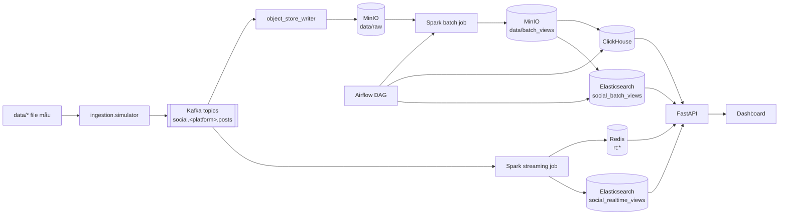

# Social Pipeline

Pipeline dữ liệu theo kiến trúc Lambda cho phân tích mạng xã hội. Dự án thu thập dữ liệu mẫu từ Reddit, Facebook và Instagram, chuẩn hóa theo schema chung, ghi sự kiện thô vào MinIO, xây dựng phân tích batch bằng Spark, duy trì serving view thời gian thực bằng Spark Structured Streaming, và cung cấp kết quả qua FastAPI cùng dashboard tĩnh.

Repository này được tối ưu cho demo Kubernetes cục bộ trên Minikube.

## Kiến trúc



## Dịch vụ

| Dịch vụ | Mục đích | URL cục bộ |
|---|---|---|
| Dashboard | Giao diện chính | http://localhost:8084 |
| FastAPI | API phục vụ và tài liệu Swagger | http://localhost:8000/docs |
| Airflow | Điều phối batch | http://localhost:8085 |
| Kafka UI | Giao diện quản lý Kafka topics và messages | http://localhost:8086 |
| MinIO Console | Giao diện quản lý object storage | http://localhost:9001 |
| Spark Master | Giao diện cluster Spark | http://localhost:8080 |
| ClickHouse | API HTTP kho dữ liệu batch | http://localhost:8123 |
| Elasticsearch | Chỉ mục tìm kiếm và phục vụ | http://localhost:9200 |
| Redis | Bộ nhớ đệm thời gian thực | `localhost:6379` |

Thông tin đăng nhập cục bộ mặc định được đặt trong `k8s/01-config/secrets.yaml` và `.env` trong quá trình thiết lập. Không commit secret thật.

## Yêu cầu hệ thống

- Docker Engine
- Minikube với driver Docker
- kubectl
- Python 3.11 với `uv` cho test cục bộ
- Ít nhất 10 GB RAM khả dụng cho Minikube, khuyến nghị 4 CPU core

Các manifest Kubernetes sử dụng `imagePullPolicy: Never`, nên image phải tồn tại bên trong Docker daemon của Minikube. Makefile đã bao gồm các lệnh `minikube-*` dành riêng cho việc này.

## Bắt đầu nhanh

```bash
git clone <repo-url>
cd social-pipeline

# 1. Tải hoặc tạo dữ liệu mẫu.
make download-data

# 2. Khởi động Minikube với project được mount tại /social-pipeline.
make minikube-start

# 3. Build image bên trong Docker daemon của Minikube.
make minikube-build-core
make minikube-build-airflow

# 4. Tạo file secret Kubernetes chỉ dùng cục bộ.
cp k8s/01-config/secrets.yaml.example k8s/01-config/secrets.yaml

# 5. Triển khai hạ tầng và ứng dụng.
make apply

# 6. Chạy port-forwarding trong terminal riêng.
make forward
```

Truy cập:

- Dashboard: http://localhost:8084
- Airflow: http://localhost:8085
- Tài liệu API: http://localhost:8000/docs

## Chạy Pipeline

Sử dụng trình tự sau cho một lần demo sạch:

```bash
make reset-data
make replay
make dag-trigger
make dag-status
```

Giải thích từng lệnh:

| Lệnh | Mô tả |
|---|---|
| `make reset-data` | Dừng writer, xóa bảng ClickHouse, dữ liệu raw/checkpoint trên MinIO, chỉ mục Elasticsearch, bộ nhớ đệm Redis, tạo lại Kafka topic, sau đó khởi động lại writer. |
| `make replay` | Chạy simulator job cho Reddit, Facebook và Instagram, giữ nguyên timestamp sự kiện gốc. |
| `make dag-trigger` | Bỏ tạm dừng và kích hoạt DAG `social_lambda_batch_pipeline`. |
| `make dag-status` | Hiển thị các lần chạy Airflow gần đây. |

Dashboard cập nhật từ cả serving view thời gian thực và batch. Bảng batch và Elasticsearch batch view xuất hiện sau khi DAG Airflow chạy xong. Các bản ghi nằm ngoài `EVENT_TIME_MIN` và `EVENT_TIME_MAX` bị bỏ qua có chủ đích; pipeline không viết lại ngày sự kiện.

### Xóa sạch và chạy lại khi hệ thống đang chạy ổn định

Khi Minikube và các service đã chạy sẵn, chỉ cần xóa dữ liệu và phát lại:

```bash
make reset-data && make replay && sleep 10 && make dag-trigger
```

Chuỗi lệnh này sẽ:
1. **Xóa sạch dữ liệu** — dừng writer, xóa bảng ClickHouse, dữ liệu MinIO, chỉ mục Elasticsearch, bộ nhớ đệm Redis, tạo lại Kafka topic
2. **Phát lại dữ liệu mẫu** — chạy simulator job cho Reddit, Facebook và Instagram
3. **Chờ 10 giây** — đợi dữ liệu được ghi vào MinIO trước khi kích hoạt batch
4. **Kích hoạt DAG** — bỏ tạm dừng và trigger DAG Airflow xử lý batch

Sau đó kiểm tra trạng thái:

```bash
make dag-status
```

### Xóa sạch và chạy lại sau khi khởi động lại máy tính

Sau khi restart máy, Minikube đã dừng và cần khởi động lại toàn bộ hạ tầng trước:

```bash
make minikube-start && make minikube-build-core && make minikube-build-airflow && make apply
```

Chờ tất cả pod sẵn sàng:

```bash
make ps    # Kiểm tra cho đến khi tất cả pod ở trạng thái Running/Completed
```

Sau đó mở port-forwarding trong terminal riêng:

```bash
make forward
```

Cuối cùng, xóa dữ liệu cũ và chạy lại pipeline:

```bash
make reset-data && make replay && sleep 10 && make dag-trigger
```

Kiểm tra trạng thái:

```bash
make dag-status
```

## Kiểm tra sức khỏe hệ thống

Khi `make forward` đang chạy:

```bash
make health
```

Các kiểm tra thủ công hữu ích:

```bash
make ps
curl -s http://127.0.0.1:8000/health
curl -s http://127.0.0.1:8000/api/v1/stats/realtime
curl -s http://127.0.0.1:8000/api/v1/virality/status
curl -s http://127.0.0.1:8000/api/v1/sentiment/model-status
```

Log Airflow:

```bash
kubectl logs -n social-pipeline deployment/airflow-scheduler --tail=120
kubectl logs -n social-pipeline deployment/airflow-webserver --tail=120
```

Log streaming:

```bash
make logs-speed
```

## Đặt lại chỉ Streaming

Nếu Spark Structured Streaming đang chạy nhưng thống kê thời gian thực trên Redis trống, hoặc log hiển thị Kafka offset timeout sau khi khởi động lại Minikube/Kafka, chỉ cần đặt lại checkpoint streaming và bộ nhớ đệm thời gian thực:

```bash
make reset-streaming
```

Sau đó replay dữ liệu lại nếu cần:

```bash
make replay
```

Lý do tồn tại: Checkpoint của Spark streaming nằm trên MinIO tại `checkpoints/speed`. Nếu Kafka topic được tạo lại hoặc offset thay đổi, Spark có thể tiếp tục từ offset checkpoint cũ. `make reset-streaming` xóa các checkpoint đó và khóa `rt:*` trên Redis, sau đó khởi động lại deployment streaming.

## Ghi chú cấu hình

Các thiết lập quan trọng cho demo cục bộ nằm trong `k8s/01-config/configmap.yaml`:

| Thiết lập | Giá trị demo | Lý do |
|---|---:|---|
| `EVENT_TIME_MIN` | `2026-01-01` | Cửa sổ demo bắt đầu từ tháng 1/2026. |
| `EVENT_TIME_MAX` | `2026-04-30` | Cửa sổ demo kết thúc tháng 4/2026. |
| `STREAM_STARTING_OFFSETS` | `earliest` | Cho phép streaming đọc bản ghi Kafka đã replay từ đầu. |
| `REALTIME_WINDOW_HOURS` | `3000` | Giữ dữ liệu demo tháng 1-4 hiển thị trên dashboard. |

`.env.example` chủ yếu dùng cho script cục bộ và tài liệu. Kubernetes sử dụng `k8s/01-config/configmap.yaml` và `k8s/01-config/secrets.yaml`.

## Secret

Tạo file secret cục bộ từ file mẫu:

```bash
cp k8s/01-config/secrets.yaml.example k8s/01-config/secrets.yaml
```

`k8s/01-config/secrets.yaml` chỉ nên dùng cục bộ. Chỉ commit:

```text
k8s/01-config/secrets.yaml.example
.env.example
```

## Artifact ML

API đọc artifact mô hình từ:

- `/app/ml/virality/artifacts`
- `/app/ml/sentiment/artifacts`

Trong Minikube, đây là hostPath mount từ:

- `/social-pipeline/ml/virality/artifacts`
- `/social-pipeline/ml/sentiment/artifacts`

Điều này phụ thuộc vào việc khởi động Minikube với repository được mount:

```bash
make minikube-start
```

Nếu dashboard báo mô hình chưa được huấn luyện, kiểm tra bên trong pod API:

```bash
kubectl exec -n social-pipeline deployments/api -- \
  sh -ec 'ls -lah /app/ml/virality/artifacts; ls -lah /app/ml/sentiment/artifacts'
```

Sentiment API và speed layer chỉ dùng artifact PhoBERT khi metadata đạt ngưỡng
`SENTIMENT_MIN_WEIGHTED_F1` và `SENTIMENT_MIN_ACCURACY`. Nếu artifact dưới
ngưỡng hoặc là smoke test, hệ thống tự dùng lexicon fallback để giữ demo ổn định.

## Phân tích chủ đề (Topic Analytics)

Các endpoint chủ đề đã được kết nối vào dashboard, nhưng dự án hiện tại không có producer topic-modeling thật ghi vào `social_topics`. Cho demo cục bộ, `ENABLE_DEMO_FALLBACK=true` trả về dữ liệu chủ đề demo cố định.

Nếu bạn cần phân tích chủ đề thật, hãy thêm job batch hoặc streaming để index tài liệu vào chỉ mục `social_topics`, sau đó đặt `ENABLE_DEMO_FALLBACK=false`.

## Tham khảo Makefile

| Lệnh | Mục đích |
|---|---|
| `make minikube-start` | Khởi động Minikube với project được mount và thiết lập `vm.max_map_count` cho Elasticsearch. |
| `make minikube-build-core` | Build `social-api-ml`, `social-python`, và `social-spark` bên trong Docker Minikube. |
| `make minikube-build-airflow` | Build image Airflow bên trong Docker Minikube. |
| `make apply` | Áp dụng namespace, config, secret, storage, hạ tầng, ứng dụng và Airflow. Không khởi động simulator job. |
| `make replay` | Áp dụng simulator job để replay ingestion cục bộ. |
| `make reset-data` | Đặt lại toàn bộ dữ liệu cho lần chạy pipeline sạch. |
| `make reset-streaming` | Xóa checkpoint Spark streaming và khóa Redis thời gian thực, sau đó khởi động lại streaming. |
| `make dag-trigger` | Bỏ tạm dừng và kích hoạt DAG Airflow. |
| `make dag-status` | Liệt kê các lần chạy DAG gần đây. |
| `make forward` | Mở port cục bộ cho dashboard, API, Airflow, MinIO, ClickHouse, Spark, Elasticsearch và Redis. |
| `make forward-kill` | Dừng tất cả tiến trình kubectl port-forward. |
| `make health` | Kiểm tra các endpoint localhost chính. |
| `make ps` | Liệt kê pod trong namespace `social-pipeline`. |

## Xử lý sự cố

### Dashboard truy cập được nhưng Overview trống

Kiểm tra thống kê thời gian thực:

```bash
curl -s http://127.0.0.1:8000/api/v1/stats/realtime
```

Nếu `stats` trống, chạy:

```bash
make reset-streaming
make replay
```

API cũng fallback sang bài viết gần đây trên Elasticsearch khi Redis trống, nên Overview vẫn hiển thị nếu Elasticsearch thời gian thực có dữ liệu.

### API vẫn chạy code cũ sau khi build lại

Có thể bạn đã build vào Docker daemon của host thay vì Minikube. Sử dụng:

```bash
make minikube-build-core
kubectl rollout restart deployment/api -n social-pipeline
```

### Airflow chạy nhưng DAG không xử lý dữ liệu mới

DAG sử dụng marker raw-data trên MinIO. Nếu không có object mới xuất hiện dưới `data/raw/`, các lần chạy theo lịch sẽ bị short-circuit. Để chạy sạch:

```bash
make reset-data
make replay
make dag-trigger
```

### Spark streaming Kafka offset timeout

Thường xảy ra khi Kafka topic/checkpoint bị lệch sau khi khởi động lại/đặt lại:

```bash
make reset-streaming
make replay
```

### Elasticsearch không khởi động được

Thiết lập `vm.max_map_count` bên trong Minikube:

```bash
minikube ssh -- sudo sysctl -w vm.max_map_count=262144
```

`make minikube-start` đã thực hiện việc này sẵn.

## Lưu ý về môi trường cục bộ

- Đây là triển khai Minikube cục bộ, không phải thiết lập Kubernetes production.
- Artifact mô hình API được mount từ repository cục bộ bằng hostPath.
- Phân tích chủ đề là fallback demo trừ khi có producer `social_topics` thật.
- Airflow điều phối công việc batch; một số job tiếp theo chạy ở chế độ Spark cục bộ bên trong pod scheduler để ổn định tài nguyên cục bộ.
- `make apply` cố tình không khởi động replay job; sử dụng `make replay` khi bạn muốn đưa dữ liệu vào.
