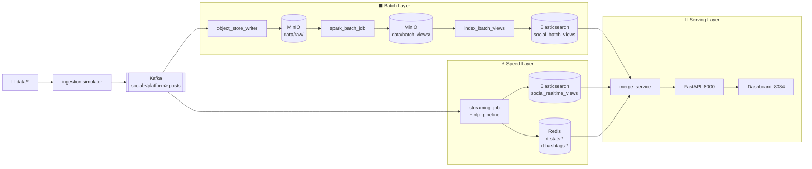

# Social Media Lambda Pipeline

Pipeline xử lý dữ liệu mạng xã hội theo kiến trúc Lambda. Thu thập bài đăng từ Reddit, Facebook và Instagram; chuẩn hóa về canonical schema; lưu raw data vào MinIO; xử lý batch bằng Spark; xử lý realtime bằng Spark Structured Streaming; phục vụ dữ liệu qua FastAPI và dashboard tĩnh.

Nhánh này triển khai trên **Kubernetes local** bằng Minikube.

## Mục Lục

- [Kiến trúc hệ thống](#kiến-trúc-hệ-thống)
- [Danh sách service](#danh-sách-service)
- [Yêu cầu môi trường](#yêu-cầu-môi-trường)
- [Lần đầu chạy (fresh setup)](#lần-đầu-chạy-fresh-setup)
- [Chạy lại sau khi tắt máy](#chạy-lại-sau-khi-tắt-máy)
- [Replay simulator và pipeline thủ công](#replay-simulator-và-pipeline-thủ-công)
- [Kiểm tra kết quả](#kiểm-tra-kết-quả)
- [Tắt dự án](#tắt-dự-án)
- [Luồng dữ liệu chi tiết](#luồng-dữ-liệu-chi-tiết)
- [Cấu hình biến môi trường](#cấu-hình-biến-môi-trường)
- [Xử lý lỗi thường gặp](#xử-lý-lỗi-thường-gặp)
- [Makefile Reference](#makefile-reference)

---

## Kiến Trúc Hệ Thống



---

## Danh Sách Service

| Service | Vai trò | URL / Cổng Host |
|---|---|---|
| Kafka | Message broker | `localhost:9092` |
| MinIO Console | Object storage UI | http://localhost:9001 |
| Spark Master | Cluster UI | http://localhost:8080 |
| Redis | Cache realtime | `localhost:6379` |
| Elasticsearch | Serving indexes | http://localhost:9200 |
| FastAPI | Serving API | http://localhost:8000 |
| Dashboard | UI tĩnh | http://localhost:8084 |
| Grafana | Metrics | http://localhost:3000 |
| Airflow | Orchestration | http://localhost:8082 |

MinIO mặc định: `minioadmin` / `minioadmin`  
Airflow mặc định: `admin` / `admin`

---

## Yêu Cầu Môi Trường

| Công cụ | Phiên bản tối thiểu | Ghi chú |
|---|---|---|
| **Minikube** | v1.32+ | Docker driver |
| **kubectl** | v1.28+ | Đã kết nối tới cluster |
| **Docker Engine** | v24+ | Đang chạy |
| **git-lfs** | v3+ | Bắt buộc — tải PhoBERT model (516 MB) |
| RAM trống | 8 GB tối thiểu | Khuyến nghị 12 GB |
| CPU | 4 cores tối thiểu | |
| Disk | 20 GB trống | Images + data |

> **Cài git-lfs nếu chưa có:**
> ```bash
> # Ubuntu/Debian
> sudo apt install git-lfs
> # macOS
> brew install git-lfs
> # Arch/CachyOS
> sudo pacman -S git-lfs
> ```
> Sau khi cài: `git lfs install`

---

## Lần Đầu Chạy (Fresh Setup)

Thực hiện theo thứ tự từ trên xuống. Mỗi bước có lệnh kiểm tra để xác nhận trước khi sang bước tiếp.

### Bước 1 — Clone và tải model

```bash
git clone <repo-url>
cd IT4931
git lfs pull
```

`git lfs pull` tải file `ml/sentiment/artifacts/fine_tuned_phobert/model.safetensors` (516 MB) — model PhoBERT đã fine-tune để phân tích cảm xúc tiếng Việt. Nếu bỏ qua bước này, API vẫn chạy nhưng sentiment fallback sang model tiếng Anh.

**Kiểm tra:**
```bash
ls -lh ml/sentiment/artifacts/fine_tuned_phobert/model.safetensors
# Phải thấy ~516 MB. Nếu chỉ thấy vài trăm bytes → git lfs pull chưa chạy
```

---

### Bước 2 — Tải dữ liệu mẫu

```bash
make download-data
```

Tải và giải nén toàn bộ dữ liệu mẫu từ Google Drive vào `data/`. Bao gồm bài đăng Reddit, Facebook, Instagram với timestamp từ `2026-01-01` trở đi.

**Kiểm tra:**
```bash
ls data/
# Phải thấy: facebook_data/  instagram_data/  reddit_data/

ls data/reddit_data/raw_data/ | head -5
# Phải thấy các file .json
```

---

### Bước 3 — Khởi động Minikube với mount

> **Quan trọng (Docker driver trên Linux):** Phải truyền `--mount` **ngay lúc start** để mount thư mục dữ liệu vào VM. Không thể mount sau khi cluster đã chạy. Simulator Jobs đọc dữ liệu từ mount này — nếu thiếu, tất cả simulator sẽ crash ngay lập tức.

```bash
minikube start --memory=8192 --cpus=4 \
  --mount --mount-string="$(pwd):/social-pipeline"
```

Lệnh này cấp 8 GB RAM, 4 CPU và mount thư mục dự án hiện tại vào `/social-pipeline` bên trong Minikube VM. **Terminal này phải giữ nguyên** trong suốt quá trình sử dụng (đừng Ctrl+C terminal chạy minikube nếu dùng `minikube start --mount`).

**Kiểm tra:**
```bash
minikube status
# host: Running
# kubelet: Running
# apiserver: Running

minikube ssh "ls /social-pipeline/data"
# Phải thấy: facebook_data  instagram_data  reddit_data
# Nếu không thấy → mount lỗi, cần xóa cluster và start lại
```

---

### Bước 4 — Build Docker images

Các manifest dùng `imagePullPolicy: Never` nên **tất cả image phải được build bên trong daemon Minikube**, không phải daemon Docker hệ thống.

```bash
eval $(minikube docker-env)
```

> **Quan trọng:** `eval $(minikube docker-env)` chỉ có hiệu lực trong terminal hiện tại. Mỗi khi mở terminal mới cần chạy lại lệnh này trước khi dùng `docker`.

```bash
make build-core
# Build: social-python:0.1.0, social-spark:3.5.3, social-ml:0.1.0
# Thời gian: ~5–10 phút

make build-api-ml
# Build: social-api-ml:0.1.0 — chứa PyTorch + Transformers + PhoBERT
# Kích thước image: ~7–10 GB
# Thời gian: ~15–30 phút tùy tốc độ mạng
```

> `make build-api-ml` bắt buộc vì pod `api` dùng image `social-api-ml:0.1.0`. Nếu bỏ qua, pod API sẽ fail với `ErrImageNeverPull`.

**Kiểm tra:**
```bash
docker images | grep social
# Phải thấy đủ 4 dòng:
# social-python    0.1.0    ...
# social-spark     3.5.3    ...
# social-ml        0.1.0    ...
# social-api-ml    0.1.0    ...
```

---

### Bước 5 — Deploy lên Kubernetes

```bash
make apply
```

Lệnh này apply toàn bộ manifest theo thứ tự: config → secrets → storage → infrastructure → apps → orchestration → simulators.

**Theo dõi trạng thái pods:**
```bash
watch kubectl get pods -n social-pipeline
# hoặc: make ps
```

**Thứ tự khởi động dự kiến:**

| Thứ tự | Pod/Job | Thời gian chờ | Trạng thái cuối |
|---|---|---|---|
| 1 | `zookeeper`, `kafka`, `minio`, `redis` | 1–2 phút | `Running` |
| 2 | `elasticsearch`, `cassandra` | 2–4 phút | `Running` |
| 3 | `kafka-init`, `minio-init` | 30 giây | `Completed` |
| 4 | `object-store-writer`, `speed-streaming` | 1–2 phút | `Running` |
| 5 | `api` | 2–5 phút | `Running` (chờ init containers) |
| 6 | `dashboard`, `spark-master`, `spark-worker` | 1–2 phút | `Running` |
| 7 | `replay-reddit`, `replay-facebook`, `replay-instagram` | 2–5 phút | `Completed` |
| 8 | `airflow-init` | 1–2 phút | `Completed` |
| 9 | `airflow-webserver`, `airflow-scheduler` | 2–3 phút | `Running` |

> **Pod `api` có 3 init containers.** Lần đầu tiên, init container `init-sentiment-artifacts` copy toàn bộ PhoBERT model (~1.5 GB) từ image vào PVC. Quá trình này mất 1–3 phút và là **hành vi bình thường** — pod sẽ ở trạng thái `Init:1/3` trong thời gian này.

> **Simulator memory:** Mỗi simulator cần 2–3 GB RAM để load file JSON. Mặc định cả 3 chạy cùng lúc — nếu máy ít RAM, xem phần [Chạy simulator từng cái một](#chạy-simulator-từng-cái-một).

**Kiểm tra tất cả sẵn sàng:**
```bash
kubectl get pods -n social-pipeline | grep -v "Running\|Completed"
# Không được có dòng nào (hoặc chỉ thấy header)
```

---

### Bước 6 — Mở port-forward

Mở **terminal mới** và chạy:

```bash
make forward
```

**Giữ terminal này chạy suốt phiên làm việc.** Ctrl+C sẽ ngắt tất cả port-forward.

Output mong đợi:
```
Forwarding: Dashboard:8084, API:8000, MinIO:9001, Spark:8080, ES:9200, Redis:6379, Grafana:3000, Airflow:8082
Press Ctrl+C to stop forwarding.
Forwarding from 127.0.0.1:8084 -> 80
Forwarding from 127.0.0.1:8000 -> 8000
...
```

**Kiểm tra:**
```bash
curl -fsS http://localhost:8000/health
# {"status":"ok"}

curl -fsS "http://localhost:9200/_cat/indices?v" | grep social
# Phải thấy social_realtime_views với docs.count > 0
```

---

### Bước 7 — Đợi simulators hoàn thành

Simulators đọc toàn bộ file dữ liệu, gửi lên Kafka theo rate cấu hình, sau đó tự kết thúc.

```bash
watch kubectl get pods -n social-pipeline | grep replay
# Đợi tất cả chuyển sang Completed:
# replay-facebook-xxxxx   0/1  Completed  0  5m
# replay-instagram-xxxxx  0/1  Completed  0  25m
# replay-reddit-xxxxx     0/1  Completed  0  15m
```

Thời gian dự kiến ở rate mặc định (20 posts/giây):
- Facebook: ~5–10 phút
- Reddit: ~10–20 phút
- Instagram: ~20–30 phút

Sau khi tất cả `Completed`, đợi thêm **60 giây** để `object-store-writer` flush Parquet cuối cùng vào MinIO.

---

### Bước 8 — Chạy Batch Pipeline

```bash
make batch
```

Spark đọc toàn bộ raw Parquet từ MinIO, tính toán 5 batch views, ghi kết quả trở lại MinIO. Output log sẽ stream ra terminal. Đợi đến khi thấy `SparkContext stopped with exitCode 0`.

**Thời gian:** ~20–40 phút (1 executor core, 64 partitions).

Sau đó index vào Elasticsearch:

```bash
make index-batch
```

**Thời gian:** ~3–5 phút.

**Kiểm tra:**
```bash
curl -fsS "http://localhost:9200/_cat/indices?v" | grep social
# social_batch_views     ... 21000+  docs
# social_realtime_views  ... 12000+  docs

curl -fsS "http://localhost:8000/api/v1/posts?start=2026-01-01T00:00:00Z&limit=3" | python3 -m json.tool
# Phải thấy data với platform, content, event_ts
```

---

### Bước 9 — Xem Dashboard

Mở trình duyệt tại **http://localhost:8084**

> **Lưu ý:** Nếu dashboard hiển thị "Loading" mãi không tải, thử hard refresh: `Ctrl+Shift+R`.

Các tab sẵn sàng sau khi batch pipeline xong:
- **Overview** — tổng quan sentiment, posts gần đây, hashtag nổi bật
- **Sentiment** — sentiment trend theo thời gian
- **Topics** — phân bổ chủ đề, trend
- **Network** — mạng quan hệ hashtag
- **Realtime** — windows realtime từ Redis
- **Posts** — danh sách posts có thể filter

---

### Bước 10 — (Tùy chọn) Train Virality Model

Model dự đoán viral (`lgbm_model.pkl`) không có sẵn trong repo — phải train từ dữ liệu đã thu thập. Chạy sau khi batch pipeline hoàn tất:

```bash
curl -X POST http://localhost:8000/api/v1/virality/train \
  -H "Content-Type: application/json" \
  -d '{"data_source": "elasticsearch"}'
```

Hoặc dùng tab **Virality** trên dashboard để trigger train và theo dõi progress log.

---

## Chạy Lại Sau Khi Tắt Máy

Sau `minikube stop`, state cluster được giữ nguyên (PVC, deployments). Nhưng có 2 vấn đề thường xảy ra sau restart cần xử lý thủ công.

### Khởi động lại cluster

```bash
minikube start
```

> **Lưu ý:** Không cần truyền lại `--mount` khi restart — mount đã được lưu trong config cluster. Lệnh `minikube start` thuần túy là đủ.

Đợi cluster ready (~1–2 phút):
```bash
minikube status
# host: Running, kubelet: Running, apiserver: Running
```

### Mở port-forward

```bash
make forward
# Giữ terminal này chạy
```

### Kiểm tra và sửa Kafka topics

Sau restart, Kafka thường **mất toàn bộ topics** (dữ liệu ephemeral trong pod). Speed-streaming sẽ bị lỗi `UnknownTopicOrPartitionException` nếu không có topics.

```bash
# Kiểm tra topics có còn không
kubectl exec -n social-pipeline deployment/kafka -- \
  kafka-topics.sh --bootstrap-server localhost:9092 --list 2>/dev/null
# Nếu output rỗng → topics đã mất, cần tạo lại
```

**Tạo lại topics:**
```bash
kubectl delete job kafka-init -n social-pipeline 2>/dev/null
kubectl apply -f k8s/03-infrastructure/kafka.yaml
# Đợi kafka-init Completed (~30 giây)
kubectl get pods -n social-pipeline | grep kafka-init
```

### Kiểm tra và sửa Speed-streaming checkpoint

Checkpoint của Spark Structured Streaming lưu offset Kafka. Sau restart, nếu Kafka mất topics và tạo lại, offset cũ trong checkpoint sẽ không còn hợp lệ → `OffsetOutOfRangeException`.

```bash
# Xóa checkpoint cũ
kubectl exec -n social-pipeline deployment/minio -- \
  bash -c "mc alias set l http://localhost:9000 minioadmin minioadmin 2>/dev/null; \
           mc rm -r --force l/social-lake/checkpoints/speed/ 2>/dev/null; echo done"

# Restart speed-streaming để bắt đầu từ earliest
kubectl rollout restart deployment/speed-streaming -n social-pipeline
```

### Kiểm tra tổng thể sau restart

```bash
kubectl get pods -n social-pipeline | grep -v "Running\|Completed"
# Không được có pod nào ở trạng thái Error/CrashLoop/OOMKilled

curl -fsS http://localhost:8000/health
# {"status":"ok"}

curl -fsS "http://localhost:9200/_cat/indices?v" | grep social
# Phải thấy social_batch_views và social_realtime_views với docs.count > 0
# (data từ lần chạy trước được giữ trong PVC Elasticsearch)
```

Dashboard tại http://localhost:8084 sẽ hiển thị data từ lần chạy trước mà không cần replay hay batch lại.

---

## Replay Simulator Và Pipeline Thủ Công

Simulators chạy dưới dạng **Kubernetes Job** — chạy một lần rồi `Completed`. Mỗi lần replay cần xóa Job cũ và tạo lại.

> **Cảnh báo:** Speed Layer dùng `HINCRBY` cộng dồn vào Redis. Replay nhiều lần **không reset** số đếm cũ → "Realtime Posts" trên dashboard bị phình. Reset Redis trước mỗi lần replay:
> ```bash
> kubectl exec -n social-pipeline deployment/redis -- redis-cli FLUSHDB
> ```

### Chạy simulator từng cái một

Mỗi simulator cần 2–3 GB RAM để load toàn bộ dữ liệu vào memory. Chạy cùng lúc 3 simulator cần ~7–8 GB RAM — nếu máy không đủ, apply toàn bộ rồi xóa ngay những job không muốn chạy:

```bash
kubectl delete job replay-reddit replay-facebook replay-instagram -n social-pipeline 2>/dev/null
kubectl apply -f k8s/07-simulators/replay.yaml

# Giữ lại chỉ 1 job, xóa 2 cái còn lại. Ví dụ chỉ chạy instagram:
kubectl delete job replay-reddit replay-facebook -n social-pipeline

# Đợi instagram Completed rồi mới chạy tiếp reddit:
kubectl apply -f k8s/07-simulators/replay.yaml
kubectl delete job replay-facebook replay-instagram -n social-pipeline
```

### Replay toàn bộ cùng lúc (nếu đủ RAM)

```bash
kubectl delete job -n social-pipeline replay-reddit replay-facebook replay-instagram 2>/dev/null
kubectl apply -f k8s/07-simulators/replay.yaml
watch kubectl get pods -n social-pipeline | grep replay
```

### Chạy lại batch sau khi replay

```bash
# Đợi tất cả simulator Completed + 60 giây flush
make batch
make index-batch
```

---

## Kiểm Tra Kết Quả

### Kiểm tra nhanh từng layer

```bash
# Layer 1: Kafka có messages không
kubectl exec -n social-pipeline deployment/kafka -- \
  kafka-topics.sh --bootstrap-server localhost:9092 --list
# Phải thấy: social.reddit.posts, social.facebook.posts, social.instagram.posts

# Layer 2: MinIO có raw data không
curl -fsS "http://localhost:9200/_cat/indices?v" | grep social
# social_batch_views     ... docs.count > 0
# social_realtime_views  ... docs.count > 0

# Layer 3: API trả về data không
curl -fsS "http://localhost:8000/api/v1/posts?start=2026-01-01T00:00:00Z&limit=5" | python3 -m json.tool

# Layer 4: Sentiment trend
curl -fsS "http://localhost:8000/api/v1/sentiment/trend?start=2026-01-01T00:00:00Z" | python3 -m json.tool

# Layer 5: Top hashtags
curl -fsS "http://localhost:8000/api/v1/hashtags/top?top_n=10" | python3 -m json.tool

# Layer 6: Realtime stats từ Redis
curl -fsS "http://localhost:8000/api/v1/stats/realtime" | python3 -m json.tool
```

> **Lưu ý:** Data trong Elasticsearch có `event_ts` theo timestamp gốc của bài đăng (2026-01-01 đến 2026-05-07), không phải thời điểm hiện tại. API endpoint `/api/v1/posts` mặc định lấy 24 giờ gần nhất — luôn truyền `start=2026-01-01T00:00:00Z` khi gọi thủ công.

### Kiểm tra logs

```bash
make logs              # Logs Serving API
make logs-speed        # Logs Speed Streaming (kiểm tra NLP enrichment)
make logs-writer       # Logs Object Store Writer (kiểm tra flush Parquet)
make logs-simulator    # Logs 3 simulator Jobs
```

### Kiểm tra health từng service

```bash
# API
curl -fsS http://localhost:8000/health

# Elasticsearch
curl -fsS "http://localhost:9200/_cluster/health?pretty" | grep status

# MinIO
curl -fsS http://localhost:9001    # Mở UI trình duyệt

# Spark
curl -fsS http://localhost:8080    # Mở UI trình duyệt
```

---

## Tắt Dự Án

```bash
# Dừng port-forward: Ctrl+C tại terminal đang chạy make forward

# Dừng cluster, giữ nguyên toàn bộ dữ liệu và PVC
minikube stop
```

Xóa hoàn toàn cluster và dữ liệu:

```bash
minikube delete
```

---

## Luồng Dữ Liệu Chi Tiết

### Kafka topics

| Topic | Mô tả |
|---|---|
| `social.reddit.posts` | Post Reddit đã normalize |
| `social.facebook.posts` | Post Facebook đã normalize |
| `social.instagram.posts` | Post Instagram đã normalize |
| `social.enriched.posts` | Post sau NLP enrichment từ speed layer |
| `social.dlq` | Record lỗi validation |

### Raw data (MinIO)

`object_store_writer` ghi Parquet partition theo platform/ngày:

```
s3a://social-lake/data/raw/<platform>/year=YYYY/month=MM/day=DD/
```

### Batch views (MinIO → Elasticsearch)

| View | Nội dung |
|---|---|
| `platform_daily_stats` | Post count, avg sentiment, total engagement theo ngày |
| `top_hashtags_weekly` | Top 100 hashtag theo tuần |
| `author_activity` | Hoạt động theo author |
| `sentiment_time_series` | Avg sentiment theo giờ |
| `top_posts` | Top 1000 posts theo engagement |

Output: `s3a://social-lake/data/batch_views/<view_name>/`  
Index Elasticsearch: `social_batch_views`

### Realtime views (Redis + Elasticsearch)

| Store | Key pattern | Nội dung |
|---|---|---|
| Redis | `rt:stats:<platform>:<hour>` | Post count, sentiment sum |
| Redis | `rt:hashtags:<platform>:<hour>` | Sorted set hashtag count |
| Elasticsearch | `social_realtime_views` | Post với enrichment fields |

### ML Models

| Model | Vị trí | Cách có |
|---|---|---|
| PhoBERT sentiment | `ml/sentiment/artifacts/fine_tuned_phobert/` | Có sẵn trong repo — cần `git lfs pull` |
| LightGBM virality | `ml/virality/artifacts/` (gitignored) | Train qua `POST /api/v1/virality/train` |

---

## Cấu Hình Biến Môi Trường

Khai báo trong [k8s/01-config/configmap.yaml](k8s/01-config/configmap.yaml):

| Biến | Mặc định | Ý nghĩa |
|---|---|---|
| `STREAM_STARTING_OFFSETS` | `earliest` | Offset bắt đầu streaming — `earliest` đảm bảo không mất data khi deploy lần đầu |
| `STREAM_TRIGGER_SECS` | `5` | Trigger interval Spark Streaming (giây) |
| `SPEED_WRITE_BATCH_SIZE` | `500` | Số record ghi mỗi micro-batch |
| `CONSUMER_FLUSH_SIZE` | `500` | Số record flush raw Parquet |
| `CONSUMER_FLUSH_INTERVAL` | `30` | Flush interval raw writer (giây) |
| `REALTIME_WINDOW_HOURS` | `24` | Window realtime khi serving merge |
| `NLP_MODEL_NAME` | `distilbert-base-uncased-finetuned-sst-2-english` | Model fallback khi PhoBERT chưa sẵn sàng |

---

## Xử Lý Lỗi Thường Gặp

### Simulator OOMKilled

**Triệu chứng:** `replay-*` ở trạng thái `OOMKilled` sau 30–90 giây.

**Nguyên nhân:** Simulator load toàn bộ file JSON vào memory. Reddit dataset (~300 MB) expand lên ~2–3 GB trong Python.

**Fix — chạy từng cái một, không chạy cả 3 cùng lúc:**
```bash
kubectl delete job replay-reddit replay-facebook replay-instagram -n social-pipeline 2>/dev/null
kubectl apply -f k8s/07-simulators/replay.yaml

# Giữ lại 1 job, xóa 2 cái còn lại
kubectl delete job replay-facebook replay-instagram -n social-pipeline
# Đợi reddit Completed rồi mới chạy cái tiếp theo
```

---

### Simulator crash — không có data trong Kafka

**Triệu chứng:** `replay-*` ở trạng thái `Error` ngay lập tức. Dashboard hiển thị toàn số 0.

**Nguyên nhân:** `/social-pipeline/data` không tồn tại trong Minikube VM — thiếu `--mount` lúc start.

**Fix:**
```bash
# Kiểm tra mount
minikube ssh "ls /social-pipeline/data"
# Nếu "No such file" → phải xóa và start lại với --mount

minikube delete
minikube start --memory=8192 --cpus=4 \
  --mount --mount-string="$(pwd):/social-pipeline"

minikube ssh "ls /social-pipeline/data"   # Xác nhận mount hoạt động

eval $(minikube docker-env)
make build-core && make build-api-ml
make apply
```

---

### Speed-streaming lỗi OffsetOutOfRange sau restart

**Triệu chứng:** Pod `speed-streaming` liên tục restart. Logs có `OffsetOutOfRangeException` hoặc `UnknownTopicOrPartitionException`.

**Nguyên nhân:** Kafka topics bị xóa sau restart → checkpoint cũ trỏ vào offset không còn tồn tại.

**Fix:**
```bash
# Bước 1: Tạo lại Kafka topics
kubectl delete job kafka-init -n social-pipeline 2>/dev/null
kubectl apply -f k8s/03-infrastructure/kafka.yaml
# Đợi kafka-init Completed

# Bước 2: Xóa Spark checkpoint cũ
kubectl exec -n social-pipeline deployment/minio -- \
  bash -c "mc alias set l http://localhost:9000 minioadmin minioadmin 2>/dev/null; \
           mc rm -r --force l/social-lake/checkpoints/speed/ 2>/dev/null; echo done"

# Bước 3: Restart speed-streaming
kubectl rollout restart deployment/speed-streaming -n social-pipeline

# Kiểm tra
kubectl logs deployment/speed-streaming -n social-pipeline --tail=20
# Phải thấy "Streaming query started" không có ERROR
```

---

### Dashboard hiển thị tất cả số 0

**Kiểm tra theo thứ tự:**

```bash
# 1. API có chạy không?
curl -fsS http://localhost:8000/health
# Nếu lỗi connection → make forward chưa chạy

# 2. Elasticsearch có data không?
curl -fsS "http://localhost:9200/_cat/indices?v" | grep social
# Nếu docs.count = 0 → chạy make batch && make index-batch

# 3. API có trả về data không?
curl -fsS "http://localhost:8000/api/v1/posts?start=2026-01-01T00:00:00Z&limit=3"
# Nếu data rỗng nhưng ES có data → kiểm tra date range

# 4. Dashboard có lỗi JS không?
# Mở F12 → Console → xem có lỗi đỏ không
```

---

### Dashboard hiển thị số post bị phình

**Nguyên nhân:** Replay nhiều lần mà không reset Redis. `HINCRBY` cộng dồn vào counter cũ.

**Fix:**
```bash
kubectl exec -n social-pipeline deployment/redis -- redis-cli FLUSHDB
```

---

### Elasticsearch bị OOMKill (exit code 137)

ES 8.x cần JVM heap + direct memory + Lucene mmap. Tăng limit trong [k8s/03-infrastructure/elasticsearch.yaml](k8s/03-infrastructure/elasticsearch.yaml):

```yaml
resources:
  requests:
    memory: 768Mi
  limits:
    memory: 1536Mi
```

---

### `make batch` báo "no resources" và không chạy

**Triệu chứng:** Spark liên tục print `Initial job has not accepted any resources; check your cluster UI`.

**Nguyên nhân:** Spark Worker vừa kết thúc job trước và đang reconnect lại với Master.

**Fix:** Đợi 30–60 giây, Worker sẽ tự reconnect. Nếu sau 2 phút vẫn không reconnect:
```bash
kubectl rollout restart deployment/spark-worker -n social-pipeline
```

---

### Pod API bị stuck ở `Init:1/3` rất lâu

**Nguyên nhân:** Init container `init-sentiment-artifacts` đang copy ~1.5 GB PhoBERT model từ image vào PVC. Lần đầu tiên chạy.

**Hành vi bình thường.** Đợi thêm 2–5 phút. Kiểm tra progress:
```bash
kubectl logs -n social-pipeline -l app=api -c init-sentiment-artifacts
# Phải thấy "Copying PhoBERT model to PVC..."
# Sau đó "Done."
```

Lần tiếp theo (model đã có trong PVC) sẽ chạy ngay lập tức với log "already present, skipping".

---

### `make build-api-ml` bị lỗi hoặc rất chậm

Image `social-api-ml:0.1.0` cài PyTorch + Transformers (~7–10 GB). Nếu bị lỗi network:
```bash
# Chạy lại — Docker build có layer cache, chỉ download lại từ layer bị lỗi
eval $(minikube docker-env)
make build-api-ml
```

---

## Makefile Reference

| Lệnh | Mô tả |
|---|---|
| `make build-core` | Build core images: `social-python`, `social-spark`, `social-ml` |
| `make build-api-ml` | Build API+ML image: `social-api-ml` (~7–10 GB, ~15–30 phút) |
| `make build-airflow` | Build Airflow image (tùy chọn) |
| `make build` | Build tất cả images (core + airflow) |
| `make download-data` | Tải và giải nén dữ liệu mẫu từ Google Drive |
| `make apply` | Apply toàn bộ manifests lên Kubernetes |
| `make delete` | Xóa namespace `social-pipeline` trên k8s |
| `make forward` | Port-forward 9 service ra host |
| `make batch` | Chạy Spark batch job (~20–40 phút) |
| `make index-batch` | Index batch views vào Elasticsearch (~3–5 phút) |
| `make warehouse` | Nạp dữ liệu vào ClickHouse |
| `make ps` | Trạng thái các Pod trong namespace `social-pipeline` |
| `make logs` | Logs Serving API pod |
| `make logs-writer` | Logs Object Store Writer pod |
| `make logs-speed` | Logs Speed Streaming pod |
| `make logs-simulator` | Logs 3 simulator Jobs (reddit, facebook, instagram) |
| `make test` | Chạy unit tests |
